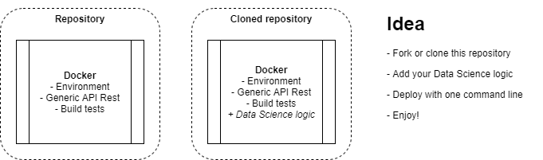

# Data Science API Framework
[](LICENSE)
[](https://github.com/leomaurodesenv/data-science-api-framework)
   
This repository is the basis for a fast, efficient and scalable python API structure for data scientists.   
This framework presents a continuous integration test using [Travis CI](https://travis-ci.com/), a [Docker](https://www.docker.com/) image to deploy your data science project, and, finally, a simple API Restful implementation to allow security access for everyone; facilitating the test, development and deployment for production.  
Combing all these things, this framework provides an potential DataOps procedure for your project. "DataOps is an automated, process-oriented methodology, used by analytic and data teams, to improve the quality and reduce the cycle time of data analytics [...] DataOps focuses on continuous delivery by leveraging on-demand IT resources and by automating test and deployment". ([Wikipedia](https://en.wikipedia.org/wiki/DataOps)).   



---
## How to start coding?
### Installation

Important links: [DockerHub](http://hub.docker.com/), [Documentation](https://docs.docker.com/).   

Each Operating System (OS) have its own steps.   
**Note**: Docker CE (Community Edition), Docker EE (Enterprise Edition).   

in **Linux**.   

```shell
# Build the container image and run
$ sh run.sh
```

in **Windows**.   

```cmd
:: Build the container image and run
$ run.bat
```

Done! You can access your API in http://localhost:5050/api/.   

### Coding your API

Modify [app/api.py](app/api.py) Python file; add your API logic.   

```python
# Called when the service is loaded
def init():
# Called when the API is requested
def run(args):
```

---
## Deep personalization

Useful personalizations:   
-   Add Python libraries for your API; see [requirements.txt](requirements.txt).
-   Add new API methods; see [app/daemon.py](app/daemon.py).
-   Improve the continuos integration tests; see [travis.yml](travis.yml).
-   Improve the Docker image; see [Dockerfile](Dockerfile).
-   Create an issue for any questions or suggestions!

---
## Also look ~

-   License [MIT](LICENSE)
-   Created by Leonardo Mauro ~ [leomaurodesenv](https://github.com/leomaurodesenv/)